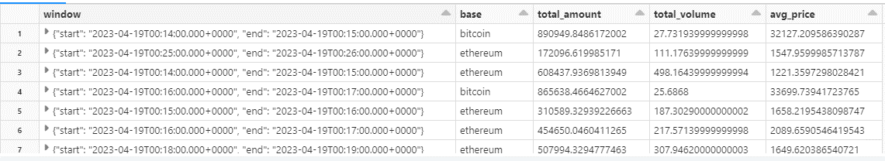
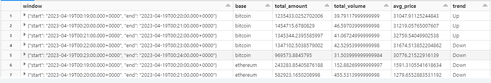

# Real-Time Streaming Analysis of Cryptocurrency Data
## What this project does
This project focuses on building a real-time streaming pipeline to analyze and monitor data from over 1000 cryptocurrencies using **CoinCap API**. The streaming data is processed and visualized using PySpark on the **Databricks** platform, providing valuable insights into volume and price metrics for each cryptocurrency.
## How this project works
#### Data Ingestion
A Python-based **Kafka producer** has been developed to fetch real-time streaming data from CoinCap API. This ensures continuous data ingestion from a wide range of cryptocurrencies.

### ETL Pipeline
The project incorporates an Extract, Transform, Load (ETL) pipeline implemented in **PySpark**. This pipeline efficiently ingests and processes the streaming data received from Kafka. It performs necessary transformations and calculations to prepare the data for analysis.

### Real-Time Analysis
The streaming data is analyzed in real-time using a **tumbling window** of 1-minute. This approach enables the calculation and display of volume and price metrics for each cryptocurrency. Users can observe market trends and performance metrics instantly.

### Performance Optimization
The project incorporates optimization techniques such as **caching** and **partitioning** to enhance the processing of streaming data. These techniques ensure efficient and speedy data processing, allowing for real-time analysis without compromising performance.

### Real-Time Dashboard
The project provides a visually appealing and interactive dashboard using **Databricks visualization** tools. This dashboard presents the analyzed metrics in a user-friendly manner. It offers a comprehensive view of the cryptocurrency market in real-time, empowering users to make informed decisions.

### Data Persistence
The processed streaming data is saved back to **Kafka** for future analysis and use. This functionality ensures the availability of historical data and facilitates further investigations or integration with other systems.

